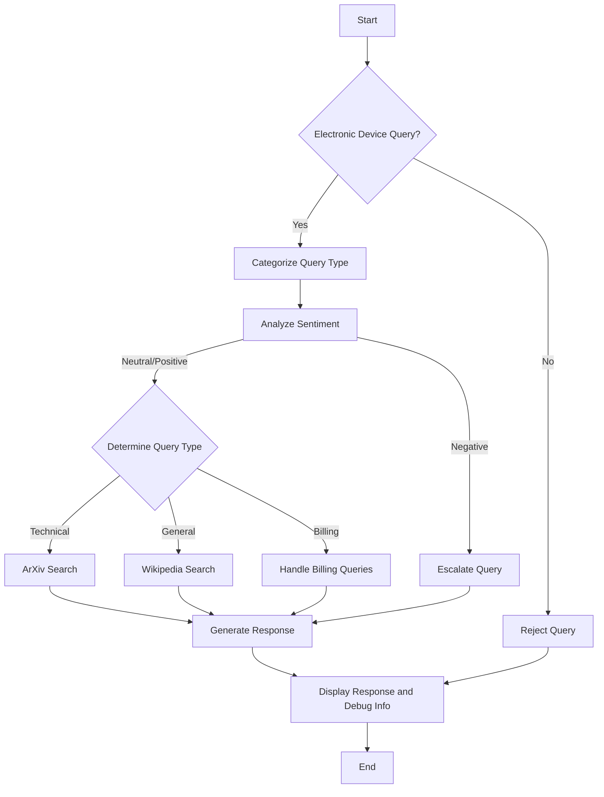
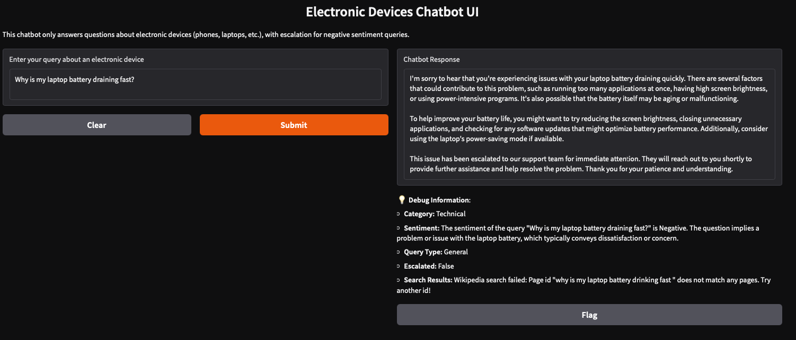
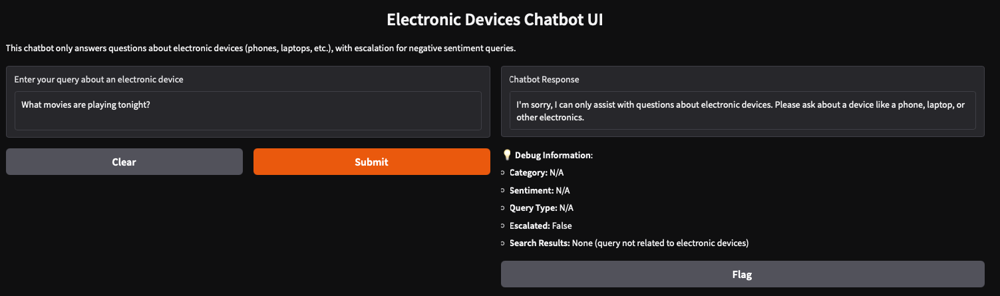
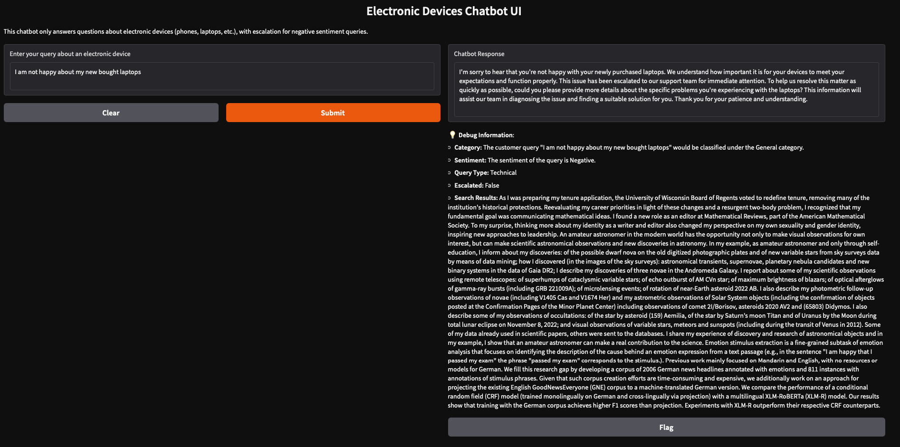

# Electronic Devices Chatbot

An intelligent chatbot built with Gradio and LangChain that exclusively answers queries related to electronic devices (such as phones and laptops). The chatbot categorizes queries, analyzes their sentiment, and escalates issues automatically when a negative sentiment is detected.

---

## 🚀 Features

- **Electronic Device Validation**: Answers **only** queries related to electronic devices.
- **Query Classification**: Identifies if queries are of **Technical**, **Billing**, or **General** type.
- **Sentiment Analysis**: Detects and categorizes sentiments as **Positive**, **Neutral**, or **Negative**.
- **Smart Search**: Quickly fetches information using **Wikipedia** (general queries) and **ArXiv** (technical queries).
- **Automatic Escalation**: Immediately escalates any negatively sentimented query for swift handling.
- **Debugging Interface**: Provides detailed insights into the chatbot's decision process.
- **LLM Integration**: Powered by **GPT-4o** for sophisticated natural language processing.

---

## ✅ Prerequisites

- **Python 3.8 or higher**
- **OpenAI API key** (stored securely in a `.env` file as `OPENAI_API_KEY`)

---

## 🛠 Installation

### 1. Clone the Repository

```bash
git clone https://github.com/yourusername/electronic-devices-chatbot.git
cd electronic-devices-chatbot
```

### 2. Install Dependencies

```bash
pip install -r requirements.txt
```

### 3. Set Up Your API Key

Create a `.env` file in the project root directory and insert your OpenAI API key:

```bash
OPENAI_API_KEY=your-api-key-here
```

---

## 🎯 Usage

Run the chatbot application from the root directory:

```bash
python chatbot.py
```

Open your browser and navigate to:

```bash
http://localhost:7860](http://localhost:7860)
```

Use the chat interface to input queries and review the responses and internal debug information.

### Examples 📝:

| Query                                            | Outcome                          |
|--------------------------------------------------|----------------------------------|
| "Why is my laptop battery draining fast?"        | ✅ Processed normally            |
| "I am upset about slow service on my new phone!" | ⚠️ Processed and escalated      |
| "What movies are playing tonight?"               | 🚫 Rejected (Out of scope)      |

---

## 📂 Project Structure


---

## 📦 Dependencies

The chatbot uses the following primary Python packages:

- `gradio`: Interactive web UI
- `langchain-openai`: Integration with OpenAI's GPT models
- `sentence-transformers`: Embeddings for semantic search
- `arxiv`: API for technical searches
- `wikipedia`: API for general information searches
- `faiss-cpu`: Efficient similarity indexing and search
- `numpy`: Fundamental numeric operations and array handling
- `python-dotenv`: Securely manage environment variables via `.env` files

Dependencies are installed via:

```bash
pip install gradio langchain-openai sentence-transformers arxiv wikipedia faiss-cpu numpy python-dotenv
```

---

## ⚙️ How it Works

The chatbot processes each query in the following manner:

1. **Electronic Device Validation** — Uses GPT-4o to verify the query relates to electronic devices.
2. **Query Categorization** — Classifies as "Technical," "Billing," or "General".
3. **Sentiment Analysis** — Determines if the sentiment is Positive, Neutral, or Negative.
4. **Smart Search** — Executes relevant searches:
   - **General Queries**: Wikipedia
   - **Technical Queries**: ArXiv scholarly articles
   - **Billing Queries**: Internal or external billing information sources (if applicable)
5. **Response Generation & Escalation** — Provides a tailored response and escalates if the sentiment is negative.
6. **Interface Update** — Displays the resulting information and debugging data using Gradio.

---

## 📌 Limitations

- Internet connection is mandatory for external searches.
- Availability and reliability depend on OpenAI API service.
- API calls might incur costs.
- Currently supports only English-language queries.

---

## ☑️ Workflow Diagram

Here's the workflow that reflects the logical sequence clearly:



## Examples
1. Processed Normally
2. Reject 
3. Escalated 